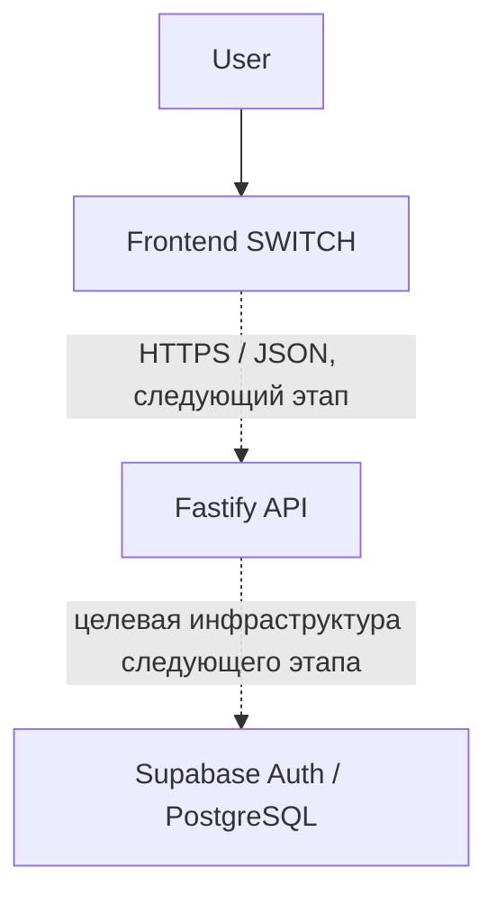

# SWITCH

SWITCH — платформа обмена знаниями и навыками между пользователями. Один пользователь может одновременно обучаться, обучать других и передавать знания дальше.

## Основная идея

Пользователь указывает навыки, которыми готов делиться, и навыки, которые хочет освоить. SWITCH объединяет каталог навыков, наставников и путь передачи знаний в одном интерфейсе.

**SWITCH Hours** — внутренняя единица времени: по концепции пользователь получает её за передачу знаний и использует для обучения у других участников. Это не реальные деньги и не криптовалюта.

## Текущий статус проекта

### Уже реализовано

- frontend на React 19 и TypeScript;
- Vinext/Vite и static export;
- deployment через GitHub Actions на GitHub Pages;
- общая навигация с base path `/SWITCH/`;
- Главная, Каталог, Преподаватели;
- Профиль — prototype/mock;
- SWITCH Hours / Wallet — prototype/mock;
- Knowledge Tree — интерактивная визуализация на mock data;
- Ratings, Achievements, Messages — prototype/mock, Calendar и Settings;
- Fastify backend foundation в `server/`;
- `GET /v1/health`;
- CORS allowlist;
- Zod validation environment-конфигурации;
- стандартное Fastify/Pino logging.

### Пока запланировано

- Authentication, регистрация и login;
- PostgreSQL / Supabase;
- persistent profiles;
- реальные SWITCH Hours и журнал операций;
- реальные lessons;
- реальные messages;
- backend deployment;
- подключение frontend к API.

Текущие prototype-экраны не являются готовой backend-функциональностью: большая часть их данных пока находится в TypeScript mock data.

## Версии проекта

### v0.1 — Product Brief

Документ: [docs/PRODUCT.md](docs/PRODUCT.md)

Описывает пользователя, проблему, альтернативные способы решения, решение SWITCH, SWITCH Hours, Knowledge Tree, пользовательские сценарии и границы MVP.

### v0.2 — Architecture

Документ: [docs/ARCHITECTURE.md](docs/ARCHITECTURE.md)

Описывает frontend, backend, модули, зависимости, хранение данных, API, целевую БД, безопасность, deployment и архитектурные альтернативы.

### Следующий этап — v0.3

Первый настоящий vertical flow:

```text
Registration → Login → Profile → Edit → API → Database → reload → data preserved
```

## Архитектура



Supabase/Auth/PostgreSQL на схеме — целевая часть следующего этапа, а не работающая production infrastructure. Сейчас в production опубликован статический frontend; Fastify существует в `server/`, но не задеплоен.

## Структура проекта

| Папка | Назначение |
|---|---|
| `app/` | Страницы и маршруты frontend. |
| `components/` | React-компоненты и prototype-страницы. |
| `data/` | Демонстрационные данные каталога и древа знаний. |
| `server/` | Отдельный Fastify API foundation. |
| `docs/` | Product Brief и архитектурная документация. |
| `public/` | Статические изображения и favicon. |
| `.github/workflows/` | GitHub Actions workflow публикации frontend. |

## Основные маршруты

```text
/
/catalog
/teachers
/profile
/messages
/calendar
/wallet
/ratings
/achievements
/knowledge-tree
/settings
```

## Запуск

### Frontend development

```bash
pnpm dev
```

### Frontend build

```bash
pnpm build
```

### Backend development

```bash
pnpm api:dev
```

### Backend build и start

```bash
pnpm api:build
pnpm api:start
```

## Deployment

Frontend: **GitHub Actions → GitHub Pages**.

<https://lyolechka15.github.io/SWITCH/>

Backend-код существует в `server/`, но пока не опубликован.

## Документация

- [docs/PRODUCT.md](docs/PRODUCT.md) — Product Brief v0.1.
- [docs/ARCHITECTURE.md](docs/ARCHITECTURE.md) — Architecture v0.2.
