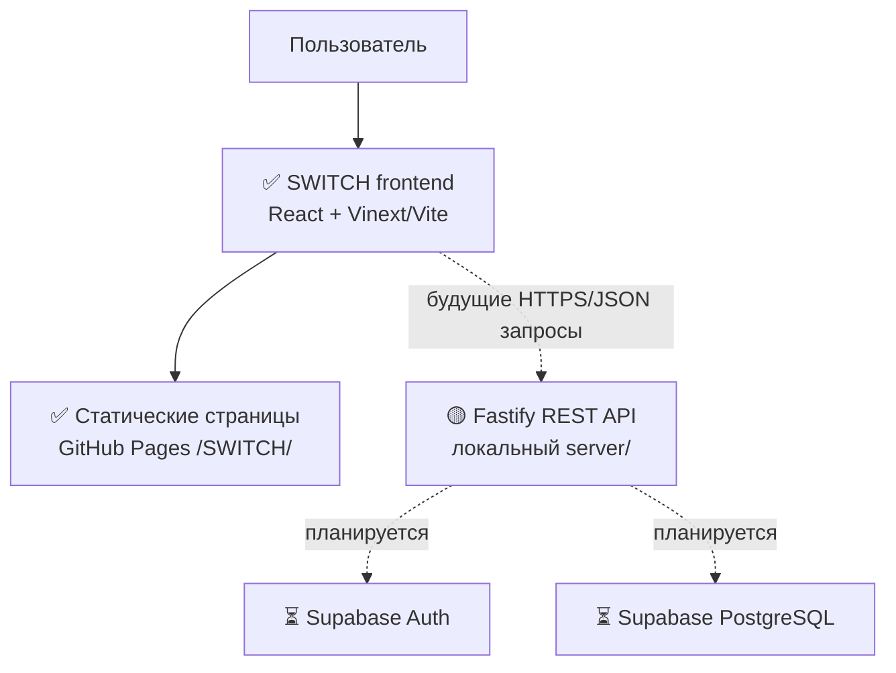
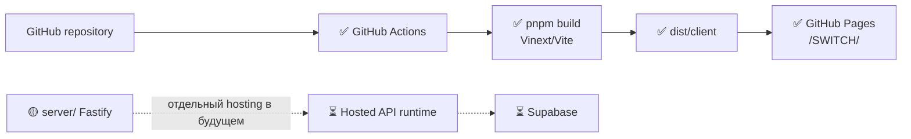
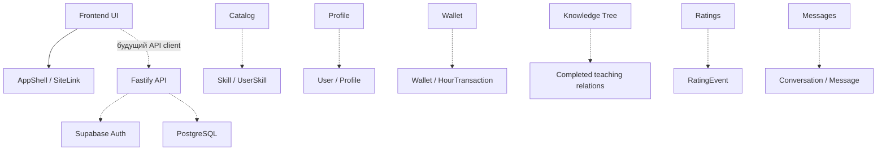
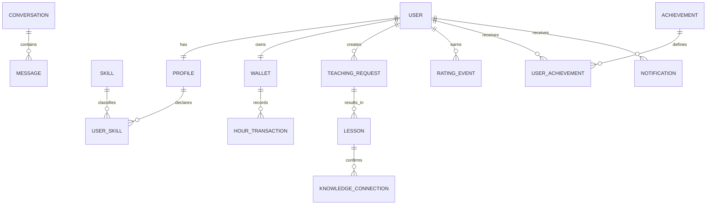

# SWITCH — Архитектура проекта

## 1. Назначение документа

Этот документ фиксирует контрольную точку **v0.2**: модули, зависимости, хранение данных и рассмотренные архитектурные альтернативы SWITCH. Он описывает фактическое состояние репозитория на момент подготовки документа и целевую архитектуру MVP.

- ✅ **Реализовано** — находится в коде и работает как часть текущего проекта.
- 🟡 **Частично реализовано** — есть интерфейс или техническая основа, но нет полной бизнес-логики/постоянных данных.
- ⏳ **Запланировано** — целевая часть MVP, которой пока нет в репозитории или production.

## 2. Общая архитектура SWITCH

Сейчас в production опубликован только статический frontend. Fastify API существует в репозитории и может запускаться локально, но не опубликован; Supabase и PostgreSQL пока не подключены.



Текущий frontend deployment отделён от будущего backend runtime:



## 3. Frontend

### Технологии и структура

✅ Frontend написан на **TypeScript** и **React 19**. Сборку выполняют **Vinext** как Next-совместимый слой и **Vite**. `vite.config.ts` устанавливает `base: "/SWITCH/"`; `next.config.ts` задаёт `output: "export"`. Это статический export, а не запущенный Next.js server.

✅ `app/` содержит файловые маршруты, `components/` — переиспользуемые UI-компоненты, `data/` — локальные mock data, CSS находится в `app/globals.css`, `app/v02.css`, `app/v03.css` и `app/v04.css`.

✅ `SiteLink` формирует href с `/SWITCH/`. Он нужен, потому что GitHub Pages публикует проект не в корне домена, а по пути `https://lyolechka15.github.io/SWITCH/`.

Ответственность frontend: показывать интерфейс, принимать пользовательские действия, отображать статические и будущие API-данные, формировать навигацию и будущие формы. Проверка прав, хранение секретов и изменение persistent-данных не должны выполняться только в браузере.

### Существующие маршруты

✅ `/`, `/catalog`, `/teachers`, `/profile`, `/messages`, `/calendar`, `/wallet`, `/ratings`, `/achievements`, `/knowledge-tree`, `/settings`.

⏳ `/login` и `/register` сейчас отсутствуют и являются частью следующего вертикального сценария MVP.

## 4. Backend

🟡 В `server/` уже создан отдельный TypeScript + Fastify service:

| Файл | Назначение |
|---|---|
| `server/src/index.ts` | Загружает config, создаёт сервер и запускает listener. |
| `server/src/app.ts` | Создаёт Fastify application, CORS, health route и единый JSON error format. |
| `server/src/config.ts` | Проверяет `PORT`, `NODE_ENV`, `CORS_ORIGINS` через Zod и завершает запуск при некорректной конфигурации. |
| `server/tsconfig.json` | Изолированная TypeScript-конфигурация backend. |
| `server/.env.example` | Пример несекретных server settings. |

✅ Единственный реализованный endpoint: `GET /v1/health`, возвращающий статус API.

Fastify выбран как компактный HTTP-framework: он маршрутизирует запросы, использует Pino logging и создаёт основу для будущих защищённых API. API отделён от frontend, потому что GitHub Pages отдаёт только статические файлы и не может исполнять server-side код, хранить секреты или безопасно работать с БД.

✅ CORS проверяет allowlist origins. ✅ Zod валидирует окружение до старта. ✅ Fastify/Pino логирует запуск и запросы. ✅ Ошибки и 404 возвращаются в едином JSON-виде.

🟡 Fastify foundation существует, но пока не задеплоен и не подключён к persistent database.

## 5. Модули системы

| Модуль | Назначение | Текущее состояние |
|---|---|---|
| Frontend UI | Страницы и визуальный интерфейс | ✅ |
| Navigation | Header, `SiteLink`, GitHub Pages base path | ✅ |
| Catalog | Интерфейс каталога навыков | 🟡 mock data |
| Teachers | Интерфейс списка наставников | 🟡 mock data |
| Profile | Экран профиля | 🟡 mock data, без сохранения |
| Authentication | Регистрация, login, сессия | ⏳ |
| Skills | Реальные навыки и связи пользователя | ⏳ |
| Wallet / SWITCH Hours | Экран баланса и концепция времени | 🟡 UI mock |
| Transactions | Журнал операций Hours | ⏳ |
| Teaching / Lessons | Запросы и завершённые занятия | ⏳ |
| Knowledge Tree | Визуализация дерева | 🟡 mock relations |
| Ratings | Интерфейс рейтинга | 🟡 mock data |
| Achievements | Интерфейс достижений | 🟡 mock data |
| Messages | UI мессенджера | 🟡 локальное state |
| Calendar | UI календаря | 🟡 mock data |
| Notifications | Уведомления | ⏳ |
| Backend API | Fastify + health/CORS/config | 🟡 |
| Database | Persistent storage | ⏳ |

## 6. Основные компоненты и классы/сущности

Проект использует функциональные React-компоненты и TypeScript-модули, а не классическую class-based архитектуру. Поэтому не следует приписывать ему несуществующие классы.

### UI-компоненты

- ✅ `AppShell` — общий header, меню и навигация.
- ✅ `SiteLink` — безопасно добавляет GitHub Pages prefix к внутренним ссылкам.
- ✅ `CatalogView` — фильтрация и отображение каталога на mock data.
- ✅ `KnowledgeTree` — интерактивная визуализация древа на локальных данных.
- ✅ `PrototypePages` — набор текущих прототипных страниц, включая profile, ratings, messages и calendar.

### Backend modules/functions

- ✅ `buildServer(config)` в `app.ts` собирает HTTP application.
- ✅ `loadConfig(env)` в `config.ts` превращает проверенные environment variables в `ApiConfig`.
- ✅ `start()` в `index.ts` запускает API.

### Domain entities

⏳ Следующие сущности — архитектурная модель будущего backend, а не реализованные таблицы: `User`, `Profile`, `Skill`, `UserSkill`, `Wallet`, `HourTransaction`, `TeachingRequest`, `Lesson`, `KnowledgeConnection`, `Conversation`, `Message`, `RatingEvent`, `Achievement`, `UserAchievement`, `Notification`.

## 7. Зависимости между модулями



Стрелки с пунктиром показывают планируемые зависимости. Текущий UI напрямую импортирует локальные mock data и не вызывает API.

## 8. Хранение данных

### Сейчас

🟡 Данные находятся в исходном коде и React state:

- `data/catalog.ts` — категории и навыки каталога;
- `data/home.ts` — часть домашнего контента;
- `data/knowledgeTree.ts` — узлы и связи визуального дерева;
- `components/PrototypePages.tsx` — mock-профиль, преподаватели, рейтинг, операции, сообщения, календарь и другие страницы;
- `components/AppShell.tsx` — mock-пользователь и баланс;
- `components/CatalogView.tsx` и `components/KnowledgeTree.tsx` — локальные интерактивные состояния.

### MVP

⏳ В PostgreSQL должны перейти users/profiles, skills/user_skills, teaching requests/lessons, wallets/hour transactions, knowledge connections, conversations/messages, rating events, achievements и notifications.

React state и localStorage не подходят как единственный источник истины: они принадлежат одному браузеру, очищаются/расходятся между устройствами и не дают server-side проверки прав или корректных финансовоподобных проводок времени.

## 9. PostgreSQL / Supabase

⏳ Целевая архитектура MVP предполагает Supabase для PostgreSQL, Supabase Auth и, возможно, Storage для avatar. Supabase удобен для учебного MVP, потому что сочетает managed PostgreSQL и готовый provider authentication; Fastify при этом сохраняется отдельным business/API layer.

Supabase credentials, schema и connection сейчас отсутствуют. Поэтому нельзя утверждать, что проект уже подключён к Supabase.

## 10. Модель данных

Это концептуальная ER-схема целевого MVP, не текущая миграция или база данных.



## 11. SWITCH Hours

⏳ SWITCH Hours — не криптовалюта и не реальные деньги, а внутренняя единица времени и обмена знаниями. Для backend нужна модель **Wallet + immutable HourTransaction ledger**.

Баланс нельзя менять отдельным произвольным update: каждая корректировка должна иметь проводку `HourTransaction`. Рекомендуемые требования:

- сумма хранится точно, например в минутах: `8.5 Hours = 510 minutes`;
- защита от двойного начисления через idempotency key и уникальную связь с исходным событием;
- запрет отрицательного баланса при списании;
- неизменяемая история операций;
- связь операции с lesson и/или пользователем;
- атомарная PostgreSQL transaction при изменении баланса и создании проводки.

Текущий экран wallet демонстрационный и не имеет ledger.

## 12. Knowledge Tree

🟡 Текущий `KnowledgeTree` показывает будущую визуализацию на mock data. ⏳ В backend дерево не должно храниться как вручную редактируемая структура.

Источником истины должны быть факты завершённого обучения. Если Ольга обучила Анну, а Анна обучила Марию, дерево по этим событиям строится как:

```text
Ольга
└── Анна
    └── Мария
```

Так нет дублирования данных; дерево можно пересчитать, отфильтровать по skill и показать по поколениям. Основанием связи служит `KnowledgeConnection`, созданный из завершённого teaching/lesson event.

## 13. Authentication

⏳ Целевая схема: **Supabase Auth → access token → frontend → Authorization header → Fastify → token verification → current user**.

Пароль не хранится в `Profile`. Frontend получает только публичную конфигурацию и пользовательский access token, но никогда не secret/service key. Backend не доверяет `userId`, присланному браузером: current user определяется только из проверенного token. Authentication пока не реализована.

## 14. API

### Уже реализовано

- ✅ `GET /v1/health`

### Планируемый API MVP

- ⏳ current user/profile: `GET /v1/me`, `GET/PATCH /v1/me/profile`;
- ⏳ skills: `GET /v1/me/skills`, `PUT /v1/me/skills`, `GET /v1/skills`, `GET /v1/teachers`;
- ⏳ wallet: `GET /v1/wallet`, `GET /v1/wallet/transactions`;
- ⏳ teaching: `POST /v1/teaching-requests` и минимальные lesson endpoints.

Полный API намеренно не фиксируется до появления первого вертикального сценария.

## 15. CORS и безопасность

✅ Backend allowlist включает `http://localhost:5173` и `https://lyolechka15.github.io`; wildcard `*` не используется. Это особенно важно для будущих authenticated requests: API должен разрешать только известные frontend origins.

⏳ Разделение environment variables:

- frontend: только `VITE_*` public values;
- backend: server configuration, database URL и secret keys.

Секреты нельзя commit, передавать frontend или логировать. Это относится к database credentials и Supabase service/secret keys.

## 16. Deployment

### Текущая реальность

✅ Frontend: `GitHub → GitHub Actions → pnpm build → dist/client → GitHub Pages → /SWITCH/`.

🟡 Backend находится в `server/`, но не опубликован. ⏳ Database не подключена.

### Целевая MVP deployment architecture

```text
GitHub Pages frontend
      → HTTPS/JSON
hosted Fastify API
      → Supabase PostgreSQL / Auth
```

## 17. Рассмотренные альтернативы

| Вариант | Плюсы | Минусы | Решение |
|---|---|---|---|
| Backend внутри frontend/API routes | Один проект | GitHub Pages не исполняет server code | Не выбран для static hosting |
| Отдельный Fastify backend | Чёткая граница, TypeScript, API можно deploy отдельно | Нужен отдельный runtime | Выбран как foundation |
| Своя PostgreSQL + свой auth | Полный контроль | Сложнее и рискованнее для учебного MVP | Не выбран на первом этапе |
| Supabase PostgreSQL + Auth | Managed DB, готовая auth, быстрый MVP | Внешняя конфигурация и credentials | Планируется |
| localStorage как основное хранилище | Быстро для прототипа | Не multi-user, нет защиты и общих данных | Только UI-state, не источник истины |
| Prisma | Зрелый ORM и migrations | Дополнительный слой/настройка | Рассматривается |
| Drizzle / SQL migrations | Типизация или прозрачный SQL | Решение ещё не зафиксировано | Рассматривается |

## 18. Почему выбрана текущая архитектура

Frontend уже удобно публикуется статически, поэтому GitHub Pages остаётся его hosting. Backend требует server runtime для проверки прав, работы с секретами и business logic. Database должна быть persistent, а authentication не стоит писать с нуля для учебного MVP.

Разделение frontend, API и database позволяет постепенно заменять mock data реальными запросами, не переписывая UI и не ломая GitHub Pages deployment.

## 19. Ограничения v0.2

- 🟡 большая часть экранов использует mock data;
- 🟡 Fastify пока не deployed;
- ⏳ database не подключена;
- ⏳ authentication не реализована;
- 🟡 API содержит только health endpoint;
- 🟡 SWITCH Hours пока mock;
- 🟡 Knowledge Tree визуализирует mock relations.

## 20. План перехода к v0.3

Следующая контрольная точка должна дать один вертикальный рабочий сценарий:

```text
Registration → Login → authenticated user → editable Profile
→ persistent PostgreSQL data → reload → data preserved
```

Это соединит все слои: `UI → Auth → API → Database → API → UI`.

## 21. Краткая памятка для защиты

«Я разделила SWITCH на frontend и backend. Frontend уже опубликован на GitHub Pages и отвечает за интерфейс, навигацию и отображение данных. GitHub Pages статичен, поэтому business logic, секреты и БД нельзя размещать там. Для этого создан отдельный Fastify API. Сейчас он реализован как foundation с health endpoint, CORS и проверкой конфигурации. Следующим шагом я подключу Supabase Auth и PostgreSQL, чтобы profile и навыки сохранялись между перезагрузками. Mock data затем будут постепенно заменяться API-данными, без переписывания существующего UI».

## 22. Простыми словами: как читать текущую архитектуру

### Frontend и путь до экрана

**Frontend** — часть SWITCH, которую пользователь видит в браузере. Она находится в `app/`, `components/`, `data/` и CSS-файлах. **React** собирает экран из небольших частей — **components**: например, `AppShell` рисует общий header, а `CatalogView` — каталог.

**TypeScript** — JavaScript с описанием типов. Он помогает заметить ошибку ещё до запуска, например передачу компоненту данных неверного вида. TypeScript используется и во frontend, и в `server/`; сам по себе он не является сервером или базой данных.

**State** — временная память компонента в открытой вкладке. В `CatalogView` это `query`, `category`, `level`, `format`, `time`, `sort`, `view` и `favourites`; они меняются через `setQuery`, `setCategory` и другие setters. Пользователь сразу видит изменения, но после reload это state не сохраняется.

**Mock data** — демонстрационные данные из исходного кода. Карточки каталога лежат в `data/catalog.ts`, а люди и связи Knowledge Tree — в `data/knowledgeTree.ts`. **Persistent data** будет храниться в PostgreSQL, поэтому останется после reload, входа с другого устройства и нового запуска приложения.

**Vinext** и **Vite** собирают исходный React-код в файлы для браузера. **Build** — это процесс `pnpm build`, создающий `dist/client`. **Static export** означает итоговые HTML, JavaScript, CSS и assets без постоянно запущенного Next-server. Их публикует **GitHub Pages**.

**GitHub Actions** — workflow из `.github/workflows/deploy-pages.yml`: он устанавливает зависимости, запускает build и публикует `dist/client`. **Deployment** — процесс, после которого сайт доступен по GitHub Pages URL.

`SiteLink` в `components/SiteLink.tsx` нужен для этого deployment. `siteHref(path)` превращает `/catalog` в `/SWITCH/catalog`, а `siteRoute(path)` убирает prefix при сравнении текущего пути. Так пользователь переходит между статическими страницами GitHub Pages без `next.config.ts basePath`.

### Backend, API и безопасность

**Backend** — код, который работает не в браузере, а в server runtime. В SWITCH он находится в `server/`. **Fastify** — framework backend: `buildServer(config)` в `server/src/app.ts` создаёт HTTP-приложение, подключает CORS и маршруты. Сейчас это foundation: сервер не опубликован, не хранит пользователей и имеет один проверочный route.

**API** — договорённость, по которой frontend в будущем запросит данные у backend. **REST API** использует URL и HTTP methods: `GET` читает данные, `PATCH` обычно меняет часть объекта. Ответы приходят в **JSON**, чтобы frontend и backend одинаково понимали поля.

`GET /v1/health` — реализованный endpoint. Fastify находит handler `app.get("/v1/health", ...)` внутри `buildServer` и возвращает JSON `{ "status": "ok", "service": "switch-api" }`. Пользователь пока не видит эту техническую проверку на экране: она нужна разработчику, чтобы убедиться, что API запущен.

**CORS** — браузерное правило, определяющее, какой сайт может обращаться к API на другом origin. В `server/src/app.ts` Set `allowedOrigins` строится из `config.corsOrigins`; разрешены localhost и GitHub Pages origin, но не wildcard `*`. Это важно для будущего auth: неизвестный сайт не должен читать приватные ответы API.

**Zod** в `server/src/config.ts` проверяет environment variables перед запуском. **Environment variables** — значения запуска, например порт и origins, которые не нужно зашивать в код. **Pino** — logging Fastify: `app.log.info` сообщает о запуске, а error handler пишет ошибки. Пароли, tokens, secret keys и database credentials логировать нельзя.

### PostgreSQL, Supabase и будущая авторизация

**PostgreSQL** — реляционная база данных будущего MVP: в ней будут profiles, skills, занятия и связанные записи. **Supabase** планируется как managed PostgreSQL и Authentication; сейчас он не подключён.

**Authentication** отвечает на вопрос «кто вошёл». В целевой схеме Supabase Auth выдаёт короткоживущий **access token / JWT** после login. Frontend отправляет его в `Authorization` header, Fastify проверяет token и определяет current user. Пароль не попадает в Profile и не обрабатывается самописным backend.

**Secret key** даёт server-only доступ и не может находиться в `VITE_*`, React-коде или GitHub Pages build. Public frontend-настройки могут иметь `VITE_*`; database URL и secrets должны быть только на backend hosting. **Database migration** — версионируемый SQL/ORM-файл для воспроизводимого создания и изменения таблиц. Migrations сейчас отсутствуют.

### SWITCH Hours и Knowledge Tree

**SWITCH Hours ledger** — будущий неизменяемый журнал операций внутреннего времени. Каждому изменению баланса соответствует `HourTransaction`; число баланса нельзя менять вручную. **Database transaction** атомарно записывает проводку и баланс: сохраняются обе операции либо ни одна. **Idempotency** защищает от двойного начисления при повторе одного запроса.

**Knowledge Tree** — экран `components/KnowledgeTree.tsx`, показывающий передачу знания между людьми. Сейчас он использует `knowledgePeople` и `knowledgeLinks` из `data/knowledgeTree.ts`; в будущем дерево будет строиться из реальных завершённых занятий, а не храниться как вручную изменяемая картинка.

# Где что находится в коде SWITCH

| Файл / папка | За что отвечает | Что происходит |
|---|---|---|
| `app/page.tsx` | Главная | Собирает home screen и CTA через `AppShell` и `SiteLink`. |
| `app/catalog/page.tsx` | Маршрут каталога | Экспортирует `CatalogView` как статическую страницу. |
| `app/knowledge-tree/page.tsx` | Маршрут дерева | Оборачивает `KnowledgeTree` в `AppShell`. |
| `components/AppShell.tsx` | Общий header | Отрисовывает навигацию, поиск, mock balance и profile dropdown. |
| `components/SiteLink.tsx` | Навигация Pages | `siteHref` добавляет `/SWITCH/`, `siteRoute` нормализует путь. |
| `components/CatalogView.tsx` | Каталог | Хранит фильтры/state и через `useMemo` вычисляет `shown`. |
| `components/KnowledgeTree.tsx` | Дерево | Выбирает узел, строит `activeLinks` и `chain`, рисует SVG связи. |
| `components/PrototypePages.tsx` | Prototype-экраны | Содержит mock UI профиля, wallet, рейтинга, сообщений и календаря. |
| `data/catalog.ts` | Catalog mock data | Экспортирует `catalogCategories` и `skills`. |
| `data/knowledgeTree.ts` | Данные дерева | Экспортирует `knowledgePeople` и `knowledgeLinks`. |
| `server/src/index.ts` | Запуск API | Вызывает `loadConfig`, `buildServer` и `app.listen`. |
| `server/src/app.ts` | Fastify API | Создаёт `buildServer`, CORS, health route, 404 и error handler. |
| `server/src/config.ts` | Проверка config | Zod-schema валидирует и `loadConfig` возвращает `ApiConfig`. |
| `.github/workflows/deploy-pages.yml` | Frontend deployment | Запускает pnpm install/build и загружает `dist/client` на Pages. |
| `docs/PRODUCT.md` | Product Brief v0.1 | Фиксирует проблему, пользователя и границы MVP. |
| `docs/ARCHITECTURE.md` | Architecture v0.2 | Фиксирует текущую и целевую архитектуру. |

# Что происходит после действия пользователя

### Пользователь открывает Каталог

`/SWITCH/catalog` → `app/catalog/page.tsx` → `CatalogView` → `catalogCategories` и `skills` из `data/catalog.ts` → React render → карточки на экране. Сейчас это mock data, API не вызывается.

### Пользователь вводит текст в поиск

`input onChange` вызывает `setQuery(e.target.value)` → меняется state `query` → `useMemo` пересчитывает `shown`, фильтруя `skills` по `skill.title` и `skill.category` → React повторно рисует карточки. Category chips вызывают `setCategory`, кнопка сброса вызывает `reset`, а favourite меняет `favourites` через `setFavourites`.

### Пользователь открывает Knowledge Tree

`/SWITCH/knowledge-tree` → `app/knowledge-tree/page.tsx` → `KnowledgeTree` → `knowledgePeople` и `knowledgeLinks` → кнопки узлов и SVG paths. State `selected` определяет человека; `activeLinks` и `chain` вычисляются через `useMemo`. `onMouseEnter`, `onFocus` и `onClick` вызывают `setSelected(person.id)`. `tree-state-toggle` меняет `empty` через `setEmpty(!empty)` и возвращает выбор к `setSelected("olga")`.

### Пользователь переходит между страницами

`SiteLink` → `siteHref` добавляет `/SWITCH/` → browser navigation → GitHub Pages отдаёт статическую страницу. Это реальная реализация внутренних ссылок без Next `basePath`.

### Backend health

`GET /v1/health` → Fastify application из `buildServer(config)` → handler `app.get("/v1/health", ...)` → JSON `{ "status": "ok", "service": "switch-api" }`.

# Если преподаватель открыл код и спросил «что здесь происходит?»

`app/page.tsx` — главная статическая страница и CTA; `SiteLink` делает переходы совместимыми с GitHub Pages.

`CatalogView.tsx` — пример React state: фильтры локально пересчитывают mock-список навыков без backend.

`KnowledgeTree.tsx` — интерактивная визуализация: получает узлы/связи из `data/knowledgeTree.ts`, подсвечивает путь и показывает цепочку знаний.

`AppShell.tsx` — общий каркас страниц. Пользователь «Ольга» и баланс в нём пока mock, это не настоящая сессия.

`SiteLink.tsx` — deployment-логика для `/SWITCH/`. `PrototypePages.tsx` — временная коллекция UI без persistent data/API.

`server/src/index.ts`, `app.ts`, `config.ts` — минимальный backend: проверяет config, создаёт Fastify service, задаёт CORS и health check; database/auth отсутствуют.

`.github/workflows/deploy-pages.yml` публикует только static `dist/client` и не deploy-ит Fastify backend.

# Как объяснить SWITCH за 2 минуты

«Я разрабатываю SWITCH — платформу, где пользователь может одновременно учиться и учить других. Сейчас есть React/TypeScript frontend: главная, каталог, преподаватели, профиль, рейтинг и интерактивное древо знаний. Сайт опубликован на GitHub Pages, но большинство данных пока демонстрационные.

Я уже отделила backend в `server/`: это Fastify API с CORS и проверкой конфигурации. GitHub Pages отдаёт статические страницы, но не может безопасно хранить пользователей, пароли и БД, поэтому backend будет размещён отдельно. Следующий этап — Supabase Auth и PostgreSQL: регистрация, вход, сохранение profile и данные после перезагрузки. Архитектура позволяет постепенно заменить mock data реальными API-данными без переписывания UI».
